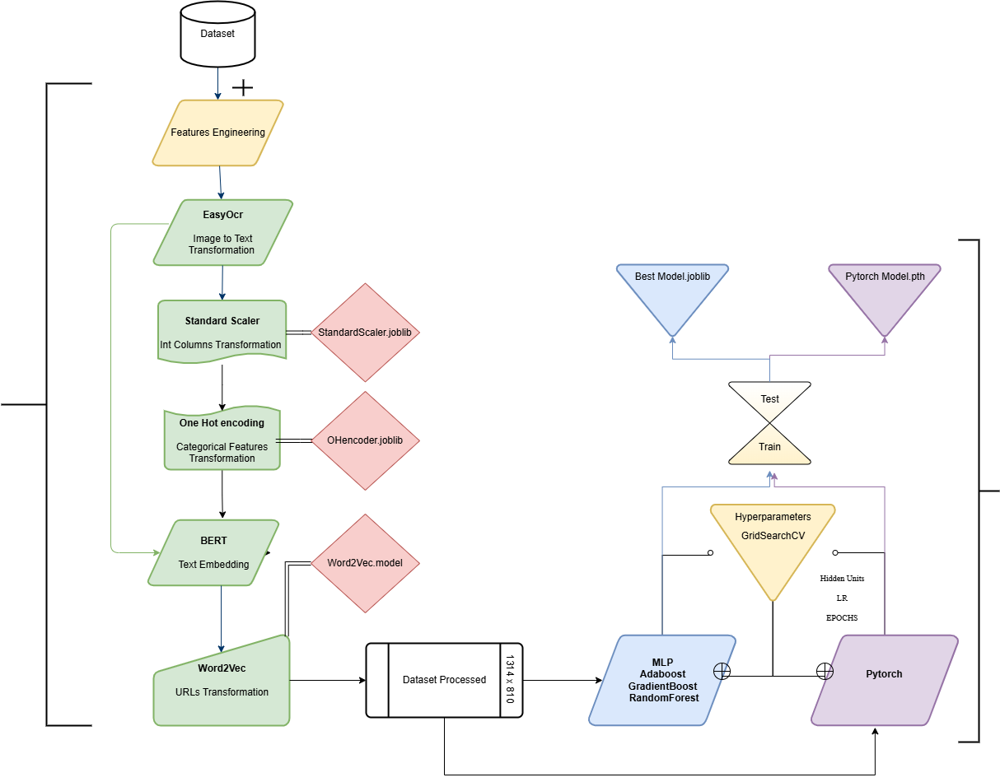
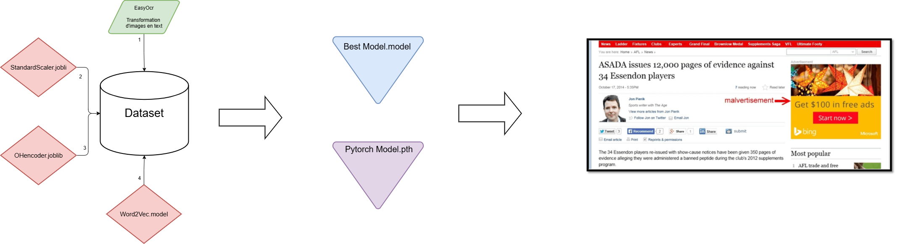

# Détection des Publicités Phishing

Ce projet a pour but de détecter les publicités malveillantes. Pour ce faire on a décidé de génerer en premier temps un modèle de Machine Learning avec un dataset qu'on a récupéré sur GitHub: 
https://github.com/eric-zeng/conpro-bad-ads-data

## 0. Pré-requis

Avant d'exécuter ce projet, il faut installer les dépendances nécessaires 
```bash
pip install -r requirement.txt
```

## 1. Génerer un modéle
```bash
python main.py
```

Le `main.py` génere le meilleur modéle entrainé sur le dataset trouvé en vérifiant:
  - L'optimisation des **hyperparamètres**.
  - La **Précision** du modèle.
  - L'analyse énergétique avec **CodeCarbon**.
  - L'**importance** des features.

Les résultats de cette analyse sont enregistrés dans le dossier `Resultat`: 
  - `Model_GR_Best.joblib` : Le modèle entraîné.
  - `StandardScaler.joblib` : Le scaler utilisé pour normaliser les données.
  - `One_Hot_Encoder.joblib` : L'encodeur des variables catégoriques.
  - `Word2Vec_model.model` : Le modèle Word2Vec utilisé pour encoder les URLs.

Remarques:

1. Les résultats des test sont stockés dans le dossier plot sous le nom :
  `{nom_model}_{%precision}.txt`

2. Les hyperparametres optimaux pour chaque model sont enregistrés dans :
  `Best_Models.joblib`



## 2. Prédiction

```bash
python Extension.py <chemin_vers_dataset>
```

Afin de prédire si une publicité est malveillante, le modéle a besoin de deux inputs:
  - Les URLs.
  - Les images des publicités.
    
### 2.1 MicroService 1 : Word2Vec

Encodage des Urls 

### 2.2 MicroService 2 : EasyOCR + BERT

Transforme les images en valeurs numériques acceptées par le modéle

  - EasyOCR : pour extraire le texte des images.
  - BERT : pour encoder les textes extraits.

Pour ce faire: 
  - Lancer le serveur sur l'adresse `http://127.0.0.1:8000` :
```bash
python MicroService2.py
```

  - API Post:
```bash
curl -X POST "http://127.0.0.1:8000/EasyOCR/" \
-H "Content-Type: application/json" \
-d '{"data": "./Dataset/NewDataset.csv", "screenshots_folder": "./"}'

```

### 2.3 MicroService 3 : Prédiction

Récupére les 2 sorties des Microservices 1 et 2 et prédit le caractére de la publicités

Le résultat est stocké dans `Resultat/Resultat_Prediction`



# Contact

Questions ou Suggestions, n'hésitez pas à me contacter à :

📧 mejri@insa-toulouse.fr

📧 mejri.hazem2070@gmail.com


